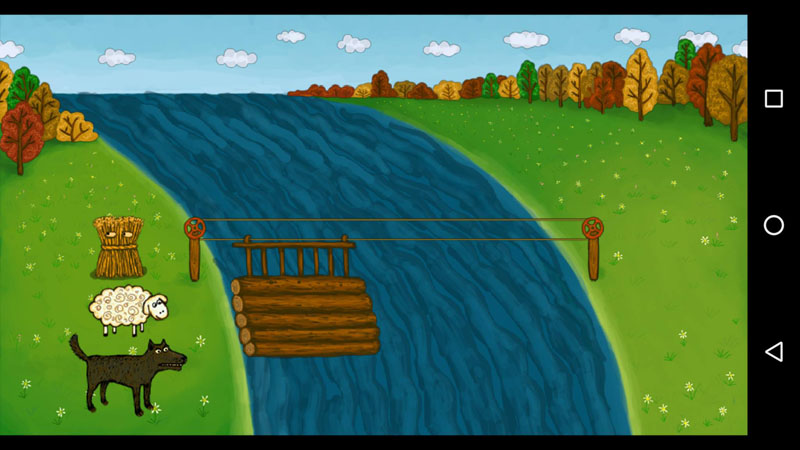

This is simple game using hazardland/game.android framework. Framework is listed as submodule. After cloning this repo submodule will not appear so to correctly initalize it run:



```
	git submodule init
	git submodule update
	cd ./game
	git checkout master
```